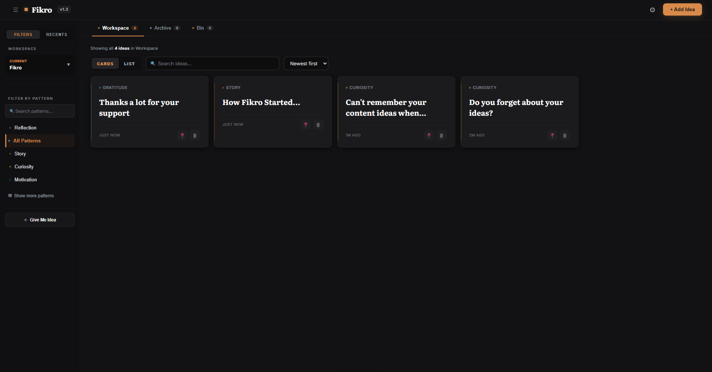
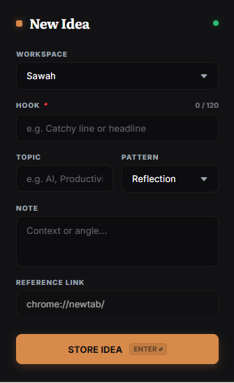

<div align="center">

<br/>


<br/><br/>

# Fikro

**Capture ideas before they're lost. Retrieve them when you're ready to create.**

*An idea capture and retrieval tool for creators, writers, and builders.*

<br/>

[](https://github.com/mahinite/fikro-public/releases/latest)
&nbsp;
[](https://github.com/mahinite/fikro-public/releases/latest)
&nbsp;
[](https://github.com/mahinite/fikro-public/stargazers)
&nbsp;
[](https://github.com/mahinite/fikro-public/releases/latest)
&nbsp;
[](./LICENSE)

<br/>

</div>

---

Fikro is a local-first desktop app for capturing ideas the moment they happen and retrieving them when you're ready to act. Press a hotkey, write a hook, assign a pattern, save. No accounts. No cloud. Everything stays on your machine.

---

## What is Fikro?

Every idea starts with a **hook** — a short line that captures the core angle before the thought disappears. You attach a **pattern** (your content category), a topic, a note, and a reference link. Ideas live in your Workspace until you're ready to act.

When you don't know what to create next, hit **Give Me Idea**. Fikro pulls something from your active pool, skipping ideas you've already seen recently.



---

## Why Fikro Exists

Creators don't run out of ideas — they lose them.

The thought in the shower. The article angle you meant to write. The video concept you kept pushing back. It ends up in a voice memo, a forgotten Notes entry, a tab you'll never reopen. Not because you didn't care, but because there was no fast, reliable place to put it — and no easy way to pull it back when you actually needed to create.

Fikro is built for the gap between *having* an idea and *acting* on one.

---

## Quick Demo

```
CAPTURE    →   Press Ctrl+Shift+Space from anywhere.
               Type your hook. Assign a pattern. Hit Enter.

ORGANISE   →   Ideas land in your Workspace.
               Filter by pattern, search by keyword, pin what matters.

RETRIEVE   →   Browse your active pool — or let Fikro pick one for you.
               Give Me Idea surfaces something you haven't seen recently.

CREATE     →   Act on it. Mark it Used. Your list stays clean for next time.
```

---

## Features

### Desktop App

- **Hook-first capture** — write a short hook that locks in the core angle. `Enter` saves without touching the mouse.
- **Pattern tagging** — colour-coded categories (e.g. Wake-Up, Tutorial, Story). Create, rename, recolour, reorder, and delete patterns in Settings.
- **Topic labels** — freeform tags (e.g. "AI", "Health", "Marketing") for cross-pattern filtering.
- **Notes and reference links** — attach context and source URLs; open links directly from the card.
- **Give Me Idea** — surfaces a random active idea, weighted toward ideas you haven't seen recently.
- **Recent picks** — last few picks tracked in the sidebar with timestamps so you can return to them.
- **Pin ideas** — keep important ideas at the top regardless of sort order.
- **Multiple workspaces** — isolated environments for different projects or contexts. Switch from the sidebar instantly.
- **Status pipeline** — Idea → Archive → Bin → Permanent delete. Bulk actions available.
- **Cards view** — expandable grid cards; click to reveal note, link, and actions.
- **Feed view** — compact scannable list for large libraries.
- **Real-time search** — filters across hooks, topics, notes, and links. Focus with `Ctrl+F` or `/`.
- **Sort options** — newest, oldest, or grouped by pattern.
- **Global hotkey** — `Ctrl+Shift+Space` opens the add modal system-wide, even from the tray.
- **System tray** — stays running when you close the window. Double-click to restore; right-click for Quick Add.
- **Clipboard detection** — if you have a URL copied when opening the modal, Fikro offers to paste it as the reference link.
- **Local HTTP API** — background server on port `13457` lets the Chrome Extension and other tools push ideas in without opening the app.
- **What's New modal** — shown after updates. Reopen with `Ctrl+Shift+U`.

### Chrome Extension

- **Capture from any tab** — send ideas into Fikro without leaving Chrome.
- **Auto-filled reference link** — current page URL is pre-populated when the popup opens.
- **Pattern and workspace selection** — choose where the idea lands before saving.
- **Live status indicator** — green when Fikro is running, red when it's not.
- **No account or API key** — connects to your local Fikro instance over `localhost`. Nothing leaves your machine.

---

## Download

> **[→ Download the latest release](https://github.com/mahinite/fikro-public/releases/latest)**

Download `Fikro_Setup.exe`, run the installer, and Fikro appears in your Start Menu and on your desktop.

> **Windows SmartScreen may show a warning.** Click **More info → Run anyway**. This is expected for apps that aren't code-signed.

---

## Installation

### Desktop App

1. Download `Fikro_Setup.exe` from the [latest release](https://github.com/mahinite/fikro-public/releases/latest)
2. Run the installer and follow the setup wizard
3. Launch Fikro from the Start Menu or desktop shortcut

---

## Chrome Extension



> **Note:** The Fikro extension is not on the Chrome Web Store. It installs via Developer Mode — a one-time step that takes under a minute. No login, no account, no cloud. The extension communicates with Fikro running locally on your machine via `localhost:13457`.

**Step-by-step installation:**

1. **Download** `fikro-extension.zip` from the [latest release](https://github.com/mahinite/fikro-public/releases/latest)
2. **Unzip** the file — you'll get a folder called `fikro-extension`
3. **Open Chrome** and go to `chrome://extensions` in the address bar
4. **Enable Developer Mode** — toggle in the top-right corner of the page
5. **Click "Load unpacked"** — a folder picker will open
6. **Select the `fikro-extension` folder** you unzipped in step 2
7. The Fikro icon will appear in your Chrome toolbar
8. **Make sure Fikro desktop app is running**, then click the extension icon to use it

> If you don't see the icon, click the puzzle piece (Extensions) button in Chrome's toolbar and pin Fikro.

---

## How It Works

**1. Capture**

Press `Ctrl+Shift+Space` from anywhere on Windows. Type your hook. Assign a pattern. Press `Enter`. The modal closes and your idea is saved.

**2. Organise**

Ideas land in your active Workspace. Filter by pattern, search by keyword, or sort by date. Pin what matters. Archive ideas once acted on; bin them when no longer relevant.

**3. Retrieve**

Browse by pattern or topic — or hit **Give Me Idea** to let Fikro surface something. The picker avoids recently seen ideas, keeping suggestions fresh.

**4. Create**

Mark the idea as Used. It moves to Archive automatically. Your active list stays clean.

---

## Global Hotkey

`Ctrl+Shift+Space` is registered system-wide. It fires even when Fikro is minimised to the tray or behind other windows.

| Shortcut | Scope | Action |
|---|---|---|
| `Ctrl+Shift+Space` | Global | Open quick-add modal from anywhere |
| `Ctrl+N` | In-app | Open add idea modal |
| `Ctrl+F` or `/` | In-app | Focus search bar |
| `Ctrl+Shift+U` | In-app | Open What's New / Changelog |
| `Enter` | Modal | Save idea |
| `Escape` | Any modal | Close modal |

---

## Workspaces

Workspaces are fully isolated environments — separate ideas, patterns, and recent picks.

Common uses: one workspace per project, channel, client, or creative mode. Switch from the sidebar dropdown. Create, rename, and delete workspaces at any time. The last workspace cannot be deleted.

---

## Pattern System

Patterns are colour-coded idea categories. Fikro ships with five defaults:

| Pattern | Colour |
|---|---|
| Wake-Up | Amber |
| Reflection | Slate |
| Tutorial | Gold |
| Story | Violet |
| Other | Ash |

Create new patterns, assign colours from a curated palette, rename inline, reorder by drag. Deleting a pattern reassigns its ideas to the next available pattern — no data is lost.

---

## Local API

Fikro runs a background HTTP server on `http://localhost:13457`. It powers the Chrome Extension and accepts ideas from any external tool or script.

**Endpoints**

```
GET  /status       →  {"status": "online"} when Fikro is running
GET  /get-patterns →  all patterns with IDs, names, and colours
GET  /get-app-data →  patterns, workspaces, and active workspace ID
POST /add-idea     →  adds an idea to Fikro
```

**POST `/add-idea` — request body**

```json
{
  "hook":         "Your idea headline",
  "topic":        "AI",
  "pattern":      "Tutorial",
  "note":         "Optional context or angle",
  "link":         "https://reference-url.com",
  "workspace_id": "optional-workspace-id"
}
```

Only `hook` is required. Omit `workspace_id` to send to the active workspace. The API is CORS-enabled for use from browser extension scripts.

---

## Built With

| Technology | Role |
|---|---|
| [Python 3.11](https://python.org) | Application logic, data layer, API server |
| [PySide6](https://doc.qt.io/qtforpython/) | Native window, system tray, global hotkey |
| [QWebEngineView](https://doc.qt.io/qt-6/qwebengineview.html) | Embeds the UI as a web application |
| [QWebChannel](https://doc.qt.io/qt-6/qwebchannel.html) | Bridges Python backend to JS frontend |
| HTML / CSS / JavaScript | Full UI — self-contained, no external dependencies |
| `http.server` (stdlib) | Threaded background API server |
| [PyInstaller](https://pyinstaller.org) | Standalone Windows executable |
| Plain JSON | Human-readable local storage |

---

## Building From Source

```bash
# Clone the repo
git clone https://github.com/mahinite/fikro-public.git
cd fikro-public

# Install dependencies
pip install PySide6

# Run directly
python main.py

# Build standalone EXE
pip install pyinstaller
pyinstaller --onefile --windowed --name "Fikro" --icon="fikro.ico" main.py
```

Output: `dist/Fikro.exe` — no Python installation required to run it.

---

## Roadmap

**Shipped**
- [x] Hook-first idea capture
- [x] Custom colour-coded pattern system
- [x] Topic tags, notes, and reference links
- [x] Give Me Idea — weighted random retrieval
- [x] Recent picks history
- [x] Pin ideas to top
- [x] Multiple workspaces
- [x] Status pipeline: Idea → Archive → Bin → Delete
- [x] Cards view and Feed view
- [x] Real-time search and sort
- [x] Global hotkey (`Ctrl+Shift+Space`)
- [x] System tray with Quick Add
- [x] Clipboard detection for URL pre-fill
- [x] Local HTTP API for external integrations
- [x] Chrome Extension (manual install)
- [x] What's New changelog modal

**Upcoming**
- [ ] Import / Export (JSON backup and restore)
- [ ] Chrome Web Store release
- [ ] Drag-to-reorder ideas

**Exploring**
- [ ] macOS support
- [ ] Markdown in notes
- [ ] Bulk idea operations

---

## Contributing

Issues and pull requests are welcome.

For bugs, open an issue with a clear description and reproduction steps. For feature requests, open a discussion first — this keeps scope intentional and the tool focused.

---

## Creator

Built by **[Mahinite](https://github.com/mahinite)**

If Fikro saves you even one good idea that would have otherwise disappeared, it has done its job. A ⭐ on the repo goes a long way.

---

## License

[MIT](./LICENSE) — use it, fork it, build on it.

---

<div align="center">

*Capture ideas before they're lost. Retrieve them when you're ready to create.*

</div>
